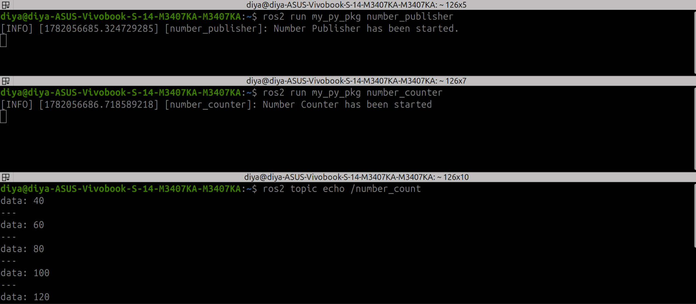
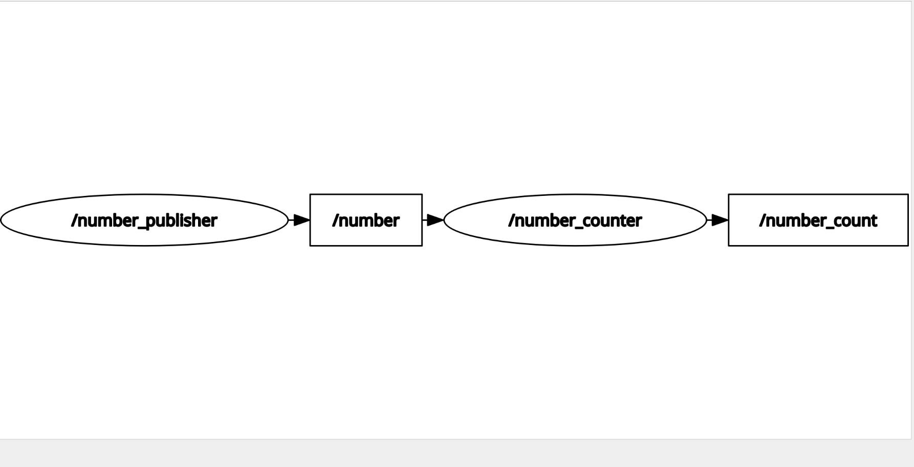

# Activity 01 - Number Publisher and Counter

## Objective

Create two ROS 2 nodes that communicate through topics:

* `number_publisher` publishes an integer on the `/number` topic.
* `number_counter` subscribes to `/number`, maintains a running sum, and publishes the result on `/number_count`.

## Concepts Practiced

* ROS 2 Publishers
* ROS 2 Subscribers
* Topic Communication
* Callback Functions
* `Int32` Messages

## Execution

### Terminal Output

### rqt_graph

