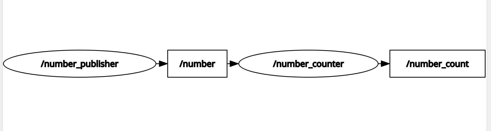

# Activity 02: Number Counter with Reset Service

## Objective

Build a ROS 2 application where one node continuously publishes numbers, another node accumulates their sum, and a service allows the accumulated count to be reset at runtime.

---

## Concepts Covered

- Publishers
- Subscribers
- Service Servers
- Service Clients
- Topic Communication
- Request-Response Communication
- `example_interfaces/msg/Int32`
- `example_interfaces/srv/SetBool`

---

## Project Structure

```text
python/
├── number_publisher.py
├── number_counter.py
└── reset_counter_client.py
```

---

## System Architecture

The system consists of three ROS 2 nodes:

1. **Number Publisher**
   - Publishes integer values on the `/number` topic.

2. **Number Counter**
   - Subscribes to `/number`.
   - Maintains a running total.
   - Publishes the accumulated count on `/number_count`.
   - Provides the `/reset_counter` service.

3. **Reset Counter Client**
   - Sends a request to the `/reset_counter` service to reset the accumulated count.

---

## Communication Flow

```text
Number Publisher
        │
        ▼
     /number
        │
        ▼
 Number Counter
   │          │
   │          └──────────────► /reset_counter (Service)
   │
   ▼
/number_count
```

---

## Demonstration

### RQt Graph



### Activity Demo

The complete demonstration video is available here:

[🎥 Watch Activity Demo](screenshots_videos/activity_demo.mp4)

---

## Key Takeaways

- A single ROS 2 node can act as both a publisher and subscriber.
- Nodes can simultaneously provide services while publishing and subscribing to topics.
- Services are useful for triggering actions that should occur only when requested.
- Topic communication and service communication can coexist within the same node.

---

## Next Steps

- Implement the C++ version.
- Extend the node to support additional services or parameters.
- Add launch files to start the complete system with a single command.