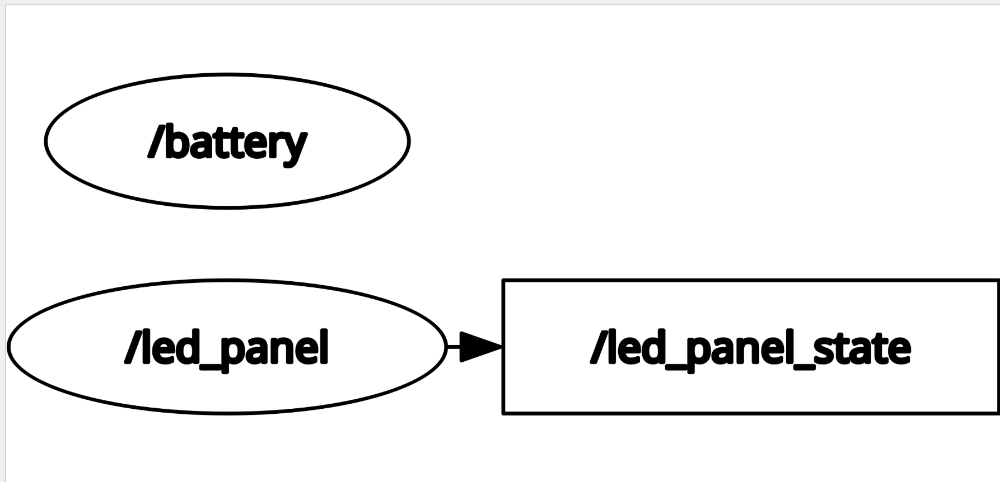

# Battery Level Indicator System

## Overview

This activity demonstrates communication between ROS 2 nodes using **custom messages** and **custom services**.

A simulated battery continuously charges and discharges between **0% and 100%**. The battery node sends its current charge level to the LED panel through a custom service. The LED panel updates a four-LED battery indicator and publishes the current LED state using a custom message.

---

## Nodes

### Battery Node
- Simulates battery charging and discharging.
- Acts as a **service client**.
- Sends the current battery percentage to the LED panel.

### LED Panel Node
- Acts as a **service server**.
- Updates the LED indicator based on the received battery percentage.
- Publishes the LED panel state.

---

## Custom Interfaces

### Message

**LedPanelState.msg**

```text
uint8[] led_status
```

Publishes the current state of all four LEDs.

---

### Service

**SetBatteryIndicator.srv**

```text
uint8 battery_level
---
bool success
string message
```

Receives the battery percentage and updates the LED panel.

---

## Battery Indicator Logic

| Battery Level | LED Status |
|--------------:|:----------|
| 0–24% | ⬜⬜⬜⬜ |
| 25–49% | 🟩⬜⬜⬜ |
| 50–74% | 🟩🟩⬜⬜ |
| 75–99% | 🟩🟩🟩⬜ |
| 100% | 🟩🟩🟩🟩 |

---

## Communication Flow

```text
Battery Node
      │
      │  SetBatteryIndicator Service Request
      ▼
LED Panel Node
      │
      │  Publishes
      ▼
/led_panel_state
```

---

## Demo
[🎥 Watch Activity Demo](screenshots_videos/activity_demo.mp4)

---

## Screenshots

### Node Graph

<p align="center">
  
</p>

## Concepts Practiced

- ROS 2 Publishers
- ROS 2 Service Clients
- ROS 2 Service Servers
- Timers
- Custom Messages
- Custom Services
- Asynchronous Service Calls
- Node Communication