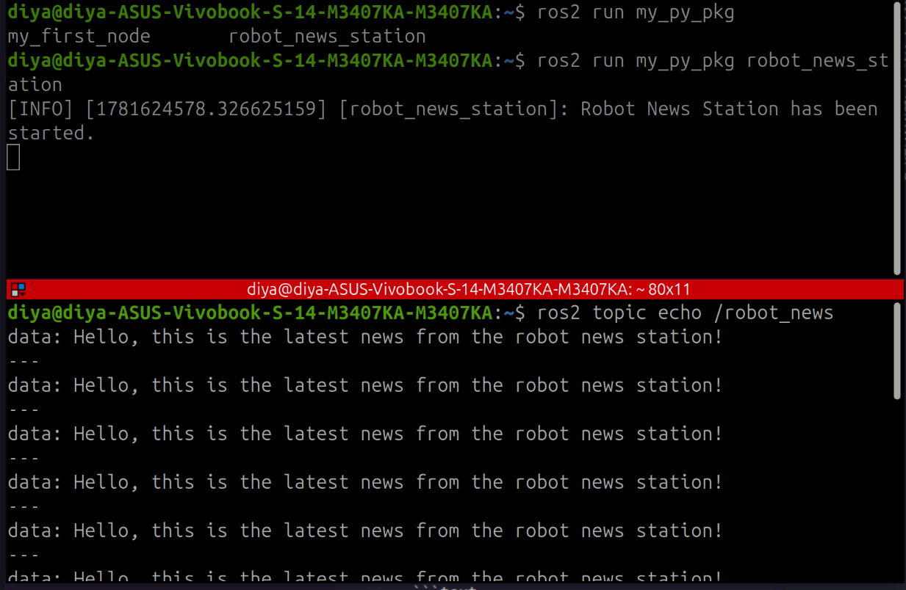
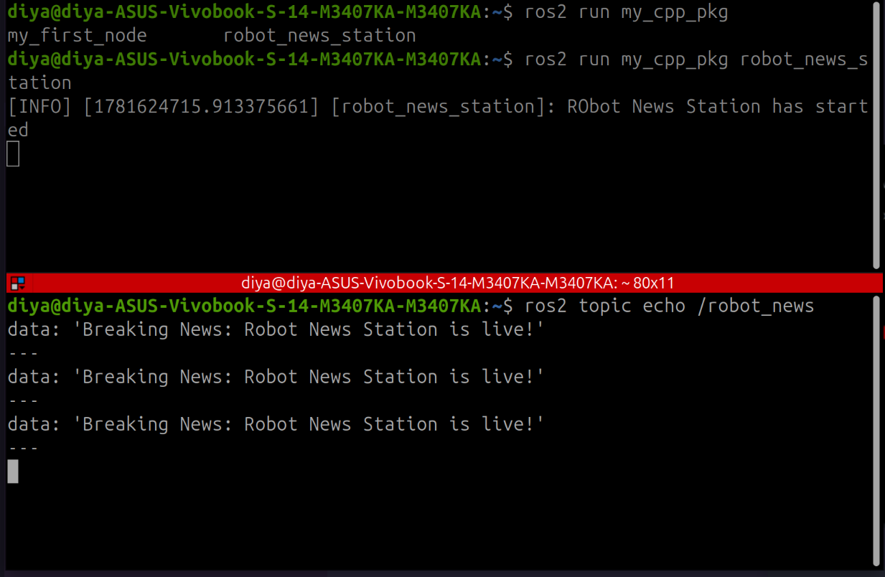

# Lesson 02: ROS 2 Topics and Publishers

## Objective

Learn how ROS 2 nodes communicate using topics by creating publisher nodes in both Python (`rclpy`) and C++ (`rclcpp`).

## Concepts Covered

* ROS 2 Topics
* Publisher Nodes
* Message Types
* Topic Names
* Queue Size
* Periodic Message Publishing using Timers

## Files

### Python

```text
python/robot_news_station.py
```

### C++

```text
cpp/robot_news_station.cpp
```

## Topic Communication

In ROS 2, nodes communicate by exchanging messages through topics.

In this lesson, a publisher node sends text messages to the topic:

```text
/robot_news
```

using the message type:

```text
example_interfaces/msg/String
```

## How It Works

1. A publisher is created on the `robot_news` topic.
2. A timer triggers at a fixed interval.
3. A `String` message is created and populated.
4. The message is published to the topic.
5. Any subscriber listening to `robot_news` can receive the message.

## Example Output

Publisher startup:

```text
Robot News Station has started
```

Published message:

```text
Breaking News: Robot News Station is live!
```
## Demonstration

### Python Publisher



### C++ Publisher


## Key Takeaways

* Topics provide asynchronous communication between ROS 2 nodes.
* Publishers send data to a topic without knowing who receives it.
* Messages are strongly typed using ROS message definitions.
* Multiple subscribers can listen to the same topic.

## Next Steps

* Create subscriber nodes
* Inspect topics using ROS 2 CLI tools
* Build a complete Publisher-Subscriber system
