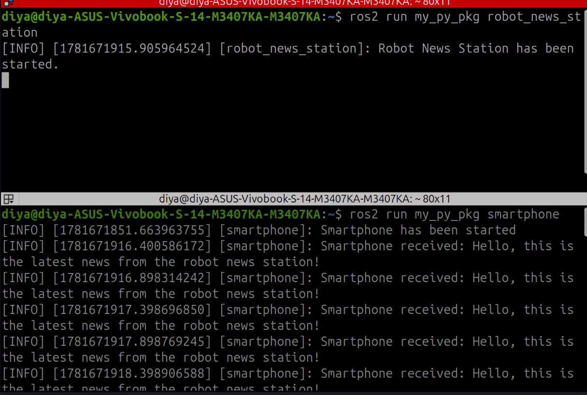
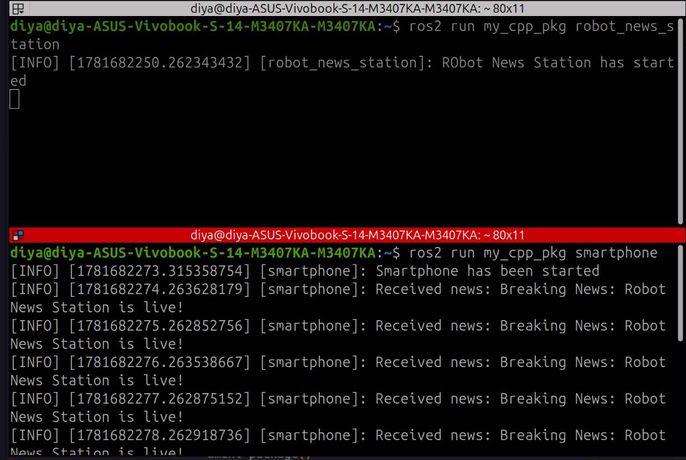

# Lesson 03: ROS 2 Subscribers

## Objective

Learn how ROS 2 nodes receive messages from topics by creating subscriber nodes in both Python (`rclpy`) and C++ (`rclcpp`).

## Concepts Covered

* ROS 2 Subscribers
* Topic Communication
* Subscription Callbacks
* Receiving Messages
* Message Types
* Publisher-Subscriber Architecture

## Files

### Python

```text
python/smartphone.py
```

### C++

```text
cpp/smartphone.cpp
```

## Topic Communication

In this lesson, the subscriber node listens to the topic:

```text
/robot_news
```

which publishes messages of type:

```text
example_interfaces/msg/String
```

Whenever a new message arrives, a callback function is executed automatically.

## How It Works

1. A subscriber is created on the `robot_news` topic.
2. The node waits for incoming messages.
3. When a message is received, the callback function is triggered.
4. The received message is displayed using the ROS 2 logger.
5. The node continues listening while it is spinning.

## Example Output

```text
Smartphone has been started
Smartphone received: Breaking News: Robot News Station is live!
Smartphone received: Breaking News: Robot News Station is live!
Smartphone received: Breaking News: Robot News Station is live!
```

## Demonstration

### Python Publisher + Python Subscriber



### C++ Publisher + C++ Subscriber




## Key Takeaways

* Subscribers receive messages from topics.
* Callback functions execute automatically when data arrives.
* Publishers and subscribers are loosely coupled and do not need direct knowledge of each other.
* Multiple subscribers can listen to the same topic.
* ROS 2 communication is built around message passing through topics.

## Next Steps

* Multiple Publishers and Subscribers
* Services and Clients
* Parameters
* Launch Files
* Actions
