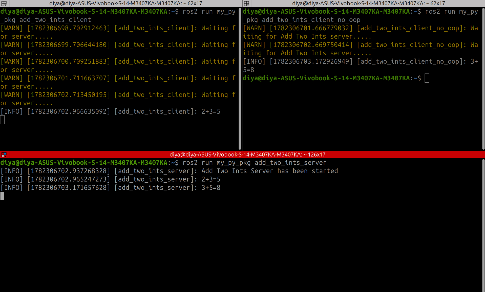
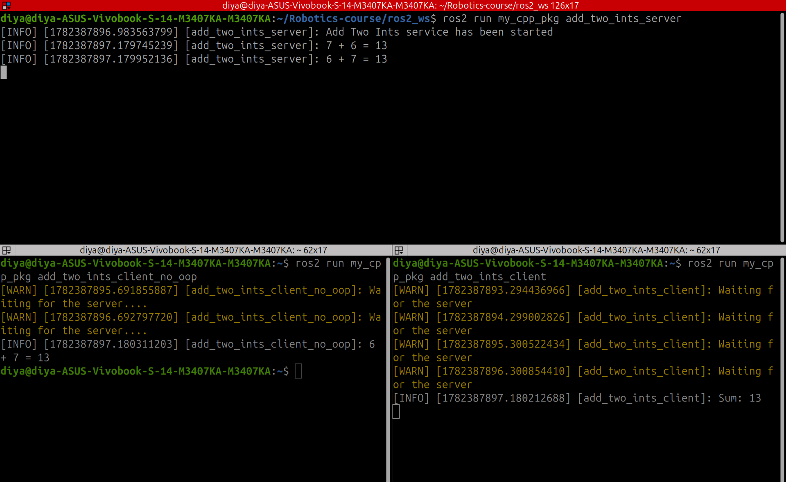

# Lesson 04: ROS 2 Services

## Objective

Learn synchronous request-response communication in ROS 2 using Services.

Unlike topics, where messages are continuously published, services allow one node to send a request and receive a response from another node.

## Concepts Covered

* ROS 2 Services
* Service Servers
* Service Clients
* Request-Response Communication
* Asynchronous Service Calls
* Object-Oriented Service Clients

## Files

### Python

```text
python/add_two_ints_server.py
python/add_two_ints_client.py
python/add_two_ints_client_no_oop.py
```

### C++

```text
cpp/add_two_ints_server.cpp
cpp/add_two_ints_client.cpp
```

## Service Used

This lesson uses the built-in ROS 2 service:

```text
example_interfaces/srv/AddTwoInts
```

Request:

```text
int64 a
int64 b
```

Response:

```text
int64 sum
```

## How It Works

1. The server creates a service named `add_two_ints`.
2. The client waits for the service to become available.
3. The client sends two integers as a request.
4. The server computes the sum.
5. The server returns the result.
6. The client receives and displays the response.

## Example Output

```text
2 + 3 = 5
```

## Demonstration

### Python Service Server and Client



### C++ Service Server and Client



## Key Takeaways

* Services provide request-response communication between nodes.
* Clients initiate requests.
* Servers process requests and return responses.
* Asynchronous service calls prevent blocking the node.
* Services are useful when a response is required immediately.

## Next Steps

* Custom Service Definitions
* Parameters
* Launch Files
