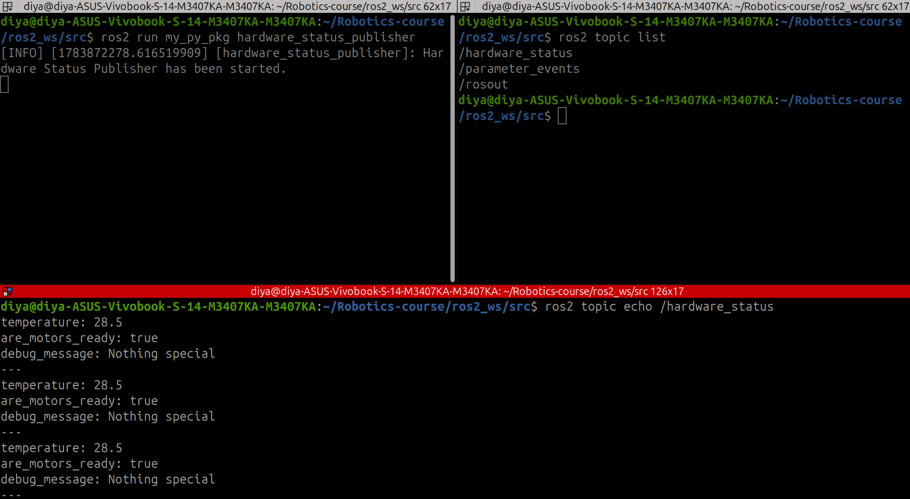

# Lesson 05: Custom ROS 2 Interfaces

## Objective

Learn how to create and use a custom ROS 2 message by publishing hardware status information from both Python and C++ nodes.

---

## Concepts Covered

- Custom ROS 2 message interfaces
- Interface packages
- Publishing custom messages
- Python (`rclpy`)
- C++ (`rclcpp`)
- Topic introspection using ROS 2 CLI

---

## Custom Message

`HardwareStatus.msg`

```text
float64 temperature
bool are_motors_ready
string debug_message
```

This custom message represents the status of a robot's hardware.

---

## Project Structure

```text
python/
└── hardware_status_publisher.py

cpp/
└── hardware_status_publisher.cpp
```

---

## Demonstration

### Python Publisher



---

### C++ Publisher


---

## Commands Used

```bash
ros2 run <package_name> hardware_status_publisher
```

```bash
ros2 topic list
```

```bash
ros2 topic echo /hardware_status
```

---

## Key Takeaways

- ROS 2 allows developers to define custom message types.
- Custom interfaces enable structured communication between robot components.
- The same interface can be shared across both Python and C++ nodes.
- ROS 2 CLI tools work seamlessly with custom message types.