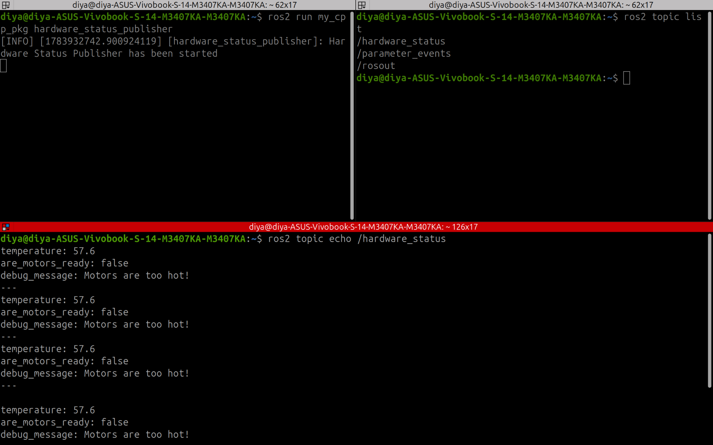
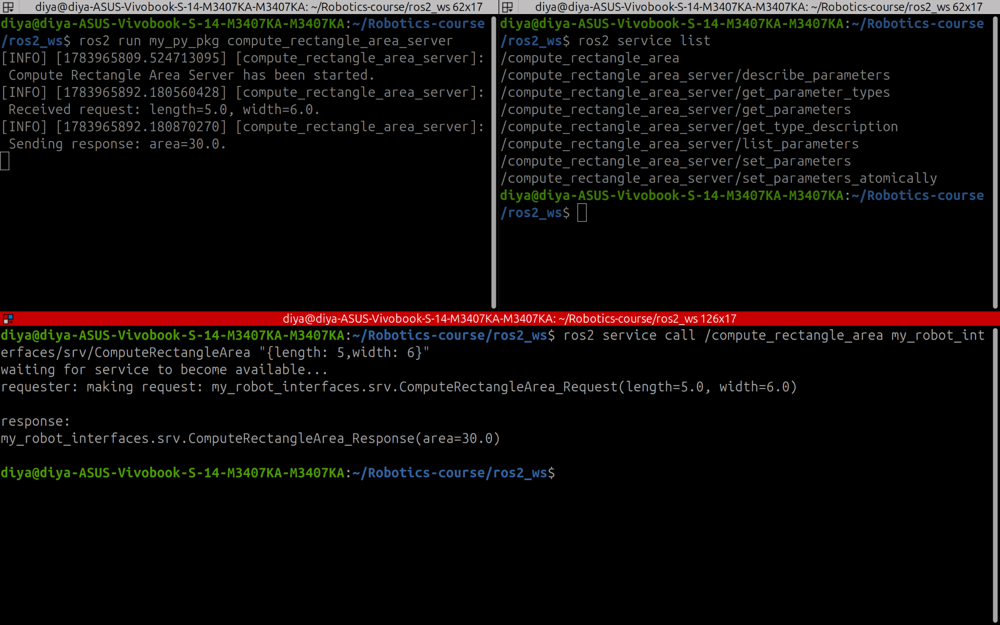
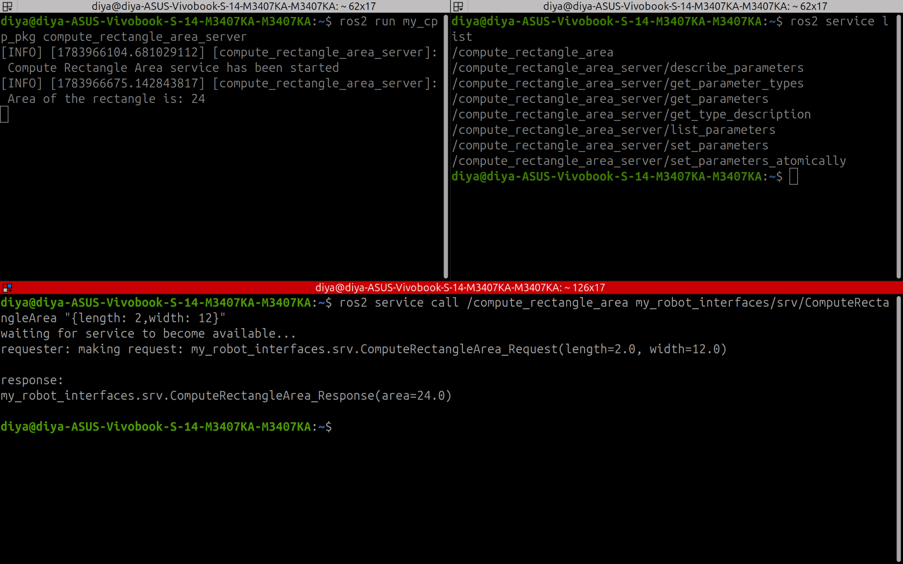

# Lesson 05: Custom ROS 2 Interfaces

## Objective

Learn how to create and use custom ROS 2 interfaces by implementing custom message and service definitions in both Python and C++.

---

# Concepts Covered

## Custom Messages (.msg)

- Creating custom message definitions
- Publishing custom messages
- Using custom messages in Python (`rclpy`)
- Using custom messages in C++ (`rclcpp`)
- Inspecting custom topics using ROS 2 CLI

### Custom Message

```text
HardwareStatus.msg

float64 temperature
bool are_motors_ready
string debug_message
```

---

## Custom Services (.srv)

- Creating custom service definitions
- Implementing custom service servers
- Processing service requests
- Returning computed responses
- Testing custom services using ROS 2 CLI

### Custom Service

```text
ComputeRectangleArea.srv

float64 length
float64 width
---
float64 area
```

---

# Folder Structure

```text
messages/
├── msg/
├── python/
├── cpp/
└── screenshots/

services/
├── srv/
├── python/
├── cpp/
└── screenshots/
```

---

# Demonstration

## Custom Message

### Python Publisher


### C++ Publisher



---

## Custom Service

### Python Server (ROS 2 CLI)



### C++ Server (ROS 2 CLI)



---

# Key Takeaways

- Created custom ROS 2 message types.
- Created custom ROS 2 service definitions.
- Implemented service servers in Python and C++.
- Shared interfaces between Python and C++ nodes.
- Used ROS 2 CLI tools to verify custom interfaces and services.